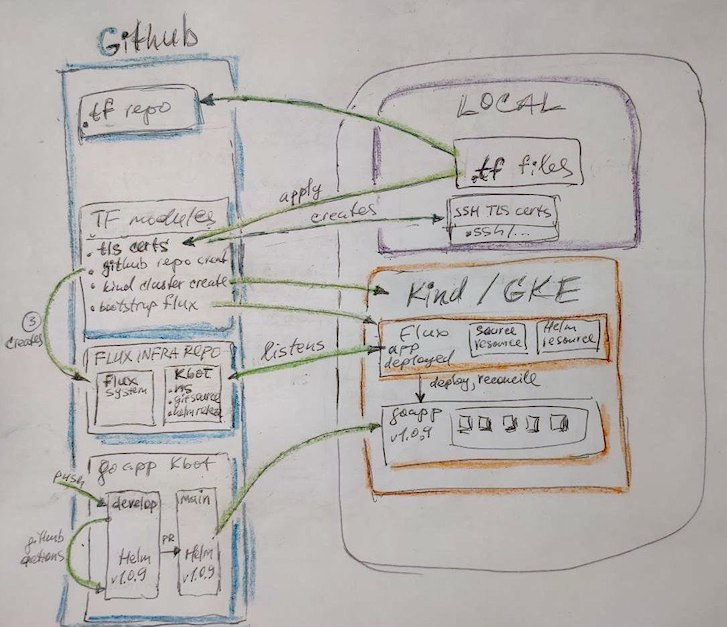

> ## NOTICE to mentors
> - I've had error with default kind_cluster module and flux `Kubernetes version v1.25.3 does not match >=1.26.0-0`.
> So I've spent some time and created my own module
> [github.com/dkzippa/tf-kind-cluster](https://github.com/dkzippa/tf-kind-cluster). 
> Now it works correctly in Kind cluster.
> 
> - I've had errors with `module.gke_cluster.kubeconfig` var in `tf-fluxcd-bootstrap` module. 
> I've tried to fork and modify the module, but had no time enough, so put provider and resource in main module. the temporary kostyl;) 
> I plan to try to solve the issue with such methods(though haven't checked them yet):
> 	- kubernetes host endpoint connection
> 	- null_resource with local-exec and KUBE_CONFIG_PATH var
> 
> - Kind cluster was implemented in `dev-local-kind` branch
> GKE cluster was implemented in `dev-google-gke`
> Both branches are merged into main with PRs.
> 
> - Infracost is run on PRs.

<br/>
<br/>
<br/>

# Terraform Flux on Kind cluster

This Terraform module creates Kind culster, deploys Flux on it. 
Flux deploys Kbot App with Helm and promotions all changes to the same cluster



## Terraform Modules used:
- github.com/den-vasyliev/tf-github-repository
- github.com/den-vasyliev/tf-google-gke-cluster


## Preparation steps:
- set aliases
    - `alias k='kubectl'`
    - `alias tf=terraform`

- install fluxcd cli from https://fluxcd.io/flux/cmd/


## Local cluster usage with Kind:

- check plan:
    - `export TF_VAR_GITHUB_OWNER=...`
    - `tf plan -var GITHUB_TOKEN=...` # ! not in exported variable TF_VAR_GITHUB_TOKEN, as it is sensitive data
- apply:
    - `tf apply -var GITHUB_TOKEN=...` 

- check flux deployed and running correctly:    
    - `k get all -A`
    - `alias k-flux='k --kubeconfig .terraform/modules/kind_cluster/kind-config -n flux-system'`
    - `k-flux get po -w`
    - `k-flux get all`

- check all is correct 
    - `flux get all`
    - `flux logs -f`

- add secret to application
    - `k create secret generic kbot -n kbot-demo --from-literal=token=...`

- create ns for the app
    - add ns.yaml to flux repo in clusters/kbot-demo folder
    ```yaml
    apiVersion: v1
    kind: Namespace
    metadata:
    name: kbot-demo
    ```
    - run reconcile faster than default 10m `flux reconcile source git flux-system`

- create resources Source and Helm Release
    - `flux create source git kbot --url=https://github.com/dkzippa/prometheus-kbot --branch=main --namespace=kbot-demo --export`
    - add content to clusters/kbot-demo/kbot-gr.yaml

    - `flux create helmrelease kbot --source=GitRepository/kbot --chart="./helm" --interval=1m --namespace=kbot-demo --export`
    - add content to clusters/kbot-demo/kbot-hr.yaml

    - check all with `flux logs -f`

## Remote cluster in Google GKE 
- change kind module to gke_cluster module
- and do the same process again


## Additonal info

- GCP CloudShell in local terminal and VSCode:

	- gcloud alpha cloud-shell ssh # ssh keys generated
		
	- get connection info
		- gcloud alpha cloud-shell ssh --dry-run 
			- add host to .ssh/config to use with your terminal or vscode remote ssh connect


	- install `gcloud-shell-zsh` from [https://github.com/Andygol/gcloud-shell-zsh](https://github.com/Andygol/gcloud-shell-zsh)
		- sh -c "$(curl -fsSL https://raw.githubusercontent.com/Andygol/gcloud-shell-zsh/main/install.sh)"
		- omz plugin enable docker gcloud kubectl terraform fluxcd

	- alias tf='terraform'; 
		alias k='kubectl';
		alias kdr='kubectl describe'; 
		alias ip='ip -c'
 


# TODO:
1) pass from TF to Flux repo a) Git source and 2) HelmRelease files
2) pass from -var(or TF_VAR_) to Flux kbot secret to create it in Kubernetes (`flux create secret ...`)
...
